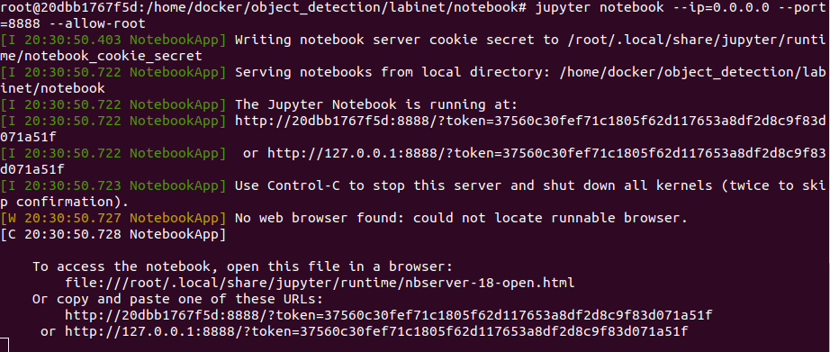

# Labinet Docker Container

_to train and test labinet images_

## TODO
- cp/mv tensorflow-models into this dir. maybe i should add git clone and keep the images and train config separately
- TODO: add script to symbolic links for data and train that should come from the host volume
  - must run docker as root (-> no -u ... )
  - PYTHONPATH does not work
  - git clone tensorflow-models -> maybe replace with my old clone
    - currently I get python code api problems (`ValueError: Protocol message SsdFeatureExtractor has no field num_layers.`)

## build this container

### Name: carstig/labinet_trainer

```
cd <path to dockerfile> 
docker build --rm -t carstig/labinet_trainer .
```

## run this container

either use `nvidia-docker` or `docker --runtime=nvidia` . This is deprecated. check that you can use `docker --gpu all` 

```
$> docker run --gpus all -it --mount type=bind,source=/home/cgreiner/python/object_detection,target=/home/docker/object_detection --rm carstig/labinet_trainer /bin/bash
``` 

from within this shell I do:
```
cd .../tensorflow-models/research/object-detection
python train.py --logtostderr --train_dir=training --pipeline_config_path=training/ssd_mobilenet_v1_coco.config
```

*note* in case the `docker --gpus` option results in an error check the docker client version which should be 1.40. For a smaller version upgrade or if even after the upgrade this version is "downgraded" , then "fix" this with a `service docker restart`

## Inference
### name: carstig/labinet_inferece
for actually doing 

### build it
```
cd inference
sudo docker build -t carstig/labinet_inference .
```

### run it
required access / parameters (in the order they appear)
- devices : camera `/dev/video*`
- open a port (for jupyter) at port `--p 8888:8888`
  - see also the command when starting jupyter has the same value 
- let docker open a window: `-e DISPLAY... -v ....X11-unix`
- access to data and model: `--mount type=bind...`

from the "shell":
- you also have to set `PYTHONPATH`


```
docker run --gpus all -it \
    --device=/dev/video0 \
    -p 8888:8888 \
    -e DISPLAY=$DISPLAY \
    -v /tmp/.X11-unix:/tmp/.X11-unix \
    --mount type=bind,source=/home/cgreiner/python/object_detection,target=/home/docker/object_detection \
    carstig/labinet_inference \
    /bin/bash
```

From within the container you can run:

```
cd object_detection/tensorflow-models/research
export PYTHONPATH=${PYTHONPATH}:`pwd`:`pwd`/object_detection:`pwd`/slim
cd -
cd object_detection/labinet/notebook
jupyter notebook --ip=0.0.0.0 --port=8888 --allow-root
```

Expect to see this:


